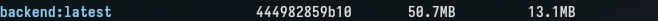

# Bloquage branche main

## Distroless image (no shell)

no apt nor shell possible

# LIVRABLE FINALE

# POUR INFO NOTRE PROJET EST DEJA UP SUR RENDER, elle sera envoyé à part comme preuve

## Architecture technique cible

L’application repose sur une architecture web moderne en 3 couches. Le frontend est une Single Page Application développée en Svelte 5, compilée via Vite et servie par un serveur NGINX très léger. Le backend est développé en Rust avec le framework web Axum, garantissant des performances maximales et une empreinte mémoire minimale, compilé statiquement grâce à rustls. Les données sont persistées de manière durable dans une base de données PostgreSQL 18. L'ensemble de cette architecture est orchestré et isolé via des conteneurs Docker pour garantir la parité entre l'environnement de développement et la production.

### Schéma Archi

       [ Navigateur Client ]
                 │
                 ▼
 ┌──────────────────────────────────┐
 │  Frontend (Svelte 5 / NGINX)     │
 │  Exposé sur le port 80           │
 └───────────────┬──────────────────┘
                 │ (Requêtes HTTP REST)
                 ▼
 ┌──────────────────────────────────┐
 │  Backend API (Rust / Axum)       │
 │  Exposé sur le port 3000         │
 └───────────────┬──────────────────┘
                 │ (Connexion TCP / SQLx)
                 ▼
 ┌──────────────────────────────────┐
 │  Base de Données (PostgreSQL 18) │
 │  Volume persistant: db_data      │
 └──────────────────────────────────┘

## Structure du repository

Le projet adopte une structure en monorepo séparant clairement les responsabilités logiques :

/frontend/ : Contient tout le code source de l'application Svelte 5, sa configuration Vite, les tests (Vitest) et son Dockerfile (NGINX).

/backend/ : Contient l'API Rust, ses migrations de base de données, la logique métier et son Dockerfile multi-stage (builder Debian + runtime Distroless).

/docs/ : Centralise la documentation technique, la gestion des risques (security.md), et les captures d'écran prouvant la configuration du dépôt.

/ (Racine) : Contient l'orchestration globale avec le docker-compose.yml, le fichier de variables d'environnement type .env.example, la configuration GitHub Actions (.github/workflows/ci.yml) et le README.md.

## Workflow Git

Le cycle de développement s'appuie sur un workflow Git collaboratif et sécurisé. La branche main représente l'état stable de production. Le développement s'effectue sur la branche d'intégration develop ou via des branches de fonctionnalités isolées (feature/*ou fix/*). Toute modification de code doit passer par une Pull Request avec un message de commit normé (Conventional Commits) et une description structurée comprenant un résumé (Quoi), une motivation (Pourquoi), un plan de validation (Comment tester) et une checklist de vérification. Ce formalisme facilite les relectures de code et la traçabilité des évolutions.

## Services Docker prévus

Le fichier docker-compose.yml orchestre trois services distincts. Le service db utilise l'image officielle postgres:18-alpine, stocke ses données sur un volume nommé db_data et implémente un healthcheck strict via pg_isready pour valider son état. Le service backend est construit à partir d'un Dockerfile multi-stage local, s'exécute de façon ultra-sécurisée sur une base Google Distroless nonroot, et démarre uniquement lorsque le service db est signalé comme sain (depends_on: condition: service_healthy). Enfin, le service frontend compile l'application Svelte via Node.js puis la sert via un conteneur minimaliste basé sur nginx:alpine.

## Variables d'environnement

La gestion des secrets et de la configuration s'effectue via des variables d'environnement. Un fichier de référence .env.example documente les clés attendues sans fournir de valeurs sensibles, et doit être dupliqué localement en .env (qui est ignoré par Git). Les variables définies concernent la configuration réseau (FRONTEND_PORT, BACKEND_PORT) et les accès à la base de données (DB_NAME, DB_USER, DB_PASSWORD). Pour la communication inter-conteneurs, le backend Rust surcharge dynamiquement sa variable DATABASE_URL dans le docker-compose.yml pour pointer vers le nom d'hôte interne du service (db) au lieu de localhost.

## Stratégie de tests

La stratégie de tests automatisée est découpée par couche logique. Côté frontend (Svelte 5), la chaîne vérifie l'absence d'erreurs de syntaxe (eslint), le respect du formatage (prettier) et exécute la suite de tests via Vitest, suivi de la vérification de la compilation vite build. Côté backend (Rust), la vérification est rigoureuse : formatage formel (cargo fmt), analyse statique stricte via le linter (cargo clippy -- -D warnings), exécution des tests unitaires (cargo test) et génération d'un rapport de couverture de code complet via l'outil cargo-tarpaulin.

## Pipeline CI prévu

L'intégration continue est automatisée via un workflow GitHub Actions (.github/workflows/ci.yml) déclenché à chaque push ou Pull Request sur les branches principales. Le pipeline est divisé en deux jobs exécutés en parallèle. Le job frontend installe l'environnement Node.js v26, utilise le cache NPM et exécute les scripts de test. Le job backend prépare la toolchain Rust stable, utilise l'action Swatinem/rust-cache pour accélérer drastiquement la compilation en réutilisant le dossier target/, et exécute la chaîne de contrôle Qualité (Clippy, Tests, Tarpaulin).

## Sécurité et secrets

La sécurité "Shift-Left" est intégrée au dépôt GitHub via l'activation de trois mécanismes clés : Dependabot alerts pour détecter les vulnérabilités publiques des dépendances, Dependabot security updates pour proposer automatiquement des correctifs, et Secret scanning pour bloquer les commits contenant des mots de passe. Au niveau du pipeline CI, les clés d'infrastructure (comme le token d'authentification Docker Hub) sont stockées chiffrées dans les GitHub Secrets sous le nom DOCKER_HUB_TOKEN et injectées de manière éphémère dans le runner CI via la directive ${{ secrets.DOCKER_HUB_TOKEN }}. Côté infrastructure, l'image Docker du backend Rust utilise l'approche Distroless pour éliminer toute surface d'attaque système (pas de shell, pas de gestionnaire de paquets).

## Logs prévus

Le projet s'appuie sur la sortie standard (stdout/stderr) collectée nativement par Docker. Le backend Rust génère des logs structurés via la configuration environnementale RUST_LOG="info,task_manager_backend=debug". Cela permet au développeur ou à l'administrateur système de filtrer précisément les traces (erreurs graves, requêtes SQLx, requêtes HTTP entrantes via Axum) directement avec la commande docker compose logs -f backend. La base de données PostgreSQL trace quant à elle ses événements de connexion et d'initialisation sur sa propre sortie.
Risques DevOps

## Risques DevOps

Risque d'escalade de privilèges système : Mitigé par la création d'images Docker backend basées sur Distroless nonroot, garantissant qu'aucune commande malveillante ne puisse être exécutée sur le serveur hôte.

Fuite de secrets dans le code source : Probabilité modérée, impact critique. Action préventive via le Secret scanning de GitHub, la configuration de .gitignore strict pour le fichier .env et la gestion via les GitHub Secrets.

Instabilité lors du démarrage de la stack (Race condition) : Le backend pourrait planter en tentant de se connecter avant que la base ne soit prête. Résolu via la configuration d'un healthcheck PostgreSQL avec un start_period couplé à un depends_on: service_healthy.

Saturation de l'espace de stockage (Base de données éphémère) : Résolu par l'implémentation d'un volume Docker persistant nommé (db_data) rattaché au répertoire standard de PostgreSQL /var/lib/postgresql/data.

Surconsommation de temps CI (Rust Builds) : La compilation native Rust étant très gourmande en CPU, le pipeline CI pourrait devenir un goulot d'étranglement. Résolu par l'intégration d'un cache puissant via l'action rust-cache et des montages --mount=type=cache pour BuildKit dans les Dockerfiles locaux.

## Commandes de lancement

Le lancement de la plateforme a été pensé pour être le plus simple possible pour un nouvel entrant dans l'équipe :

# 1. Cloner le répertoire

git clone <url-du-depot>
cd devops-tp-quentin-gouttaya

# 2. Configurer les variables d'environnement locales

cp .env.example .env

# 3. Construire et démarrer l'ensemble des services en arrière-plan

docker compose up -d --build

L'application web Svelte sera ensuite accessible sur <http://localhost> et l'API Rust sur <http://localhost:3000>. Pour arrêter proprement les services : docker compose down.

## Prochaines actions

À court terme, les efforts devront se concentrer sur l'implémentation du déploiement continu (CD). Le pipeline GitHub Actions sera enrichi d'un nouveau job qui, suite à la validation des tests, construira automatiquement les images Docker (Backend Distroless et Frontend NGINX) et les publiera sur le registre sécurisé Docker Hub (via le secret DOCKER_HUB_TOKEN). Ensuite, un environnement de Staging cloud (type VPS) sera configuré pour tirer automatiquement ces images publiées via un webhook Watchtower, validant ainsi la chaîne complète de livraison continue.
